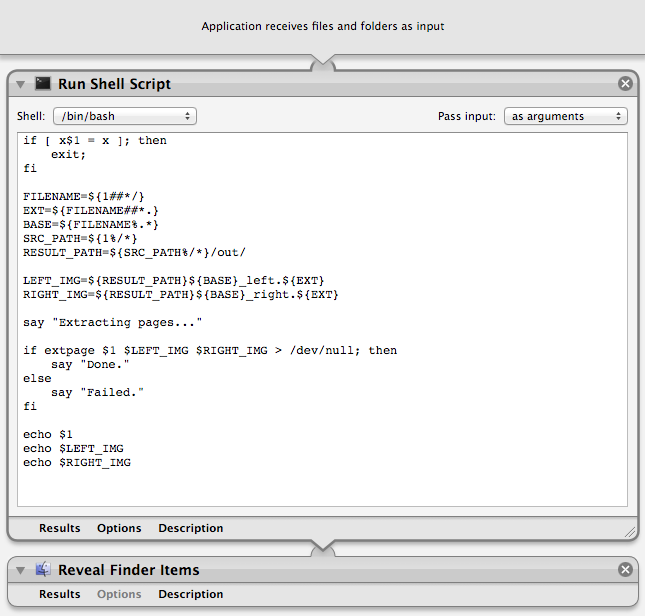

bookscan
========

Single camera solution for book scanner.

## WARNING: EXPERIMENTAL PROJECT

This program was written in ad-hoc manner without thinking about
publishing the source code. It was just a test of concept.

I've got many requests to publish the program after I posted YouTube videos:

* [Book Scanner: First Prototype](http://www.youtube.com/watch?v=rjzxlA9RWio)
* [Book Scanner: Marker Test](http://www.youtube.com/watch?v=YXANjnry6CU)
* [Book Scanner: Image Processing Test #1](http://www.youtube.com/watch?v=lHHPFBH2EkA)

So I published it. But it was a project that was done in a day years ago, and
I have no time to verify it still works today.

## Compilation

Install OpenCV and SCons:

    sudo port install opencv scons

Compile using SCons:

    scons

## Usage

The program takes three arguments:

    ./extpage test_input.jpg output_left.jpg output_right.jpg

where test_input.jpg is the input file name, and the following two are the
output file names.

### Debugging using Webcam

To debug using an webcam, execute the program without an argument:

	./extpage

### Using Automator.app

One way to automate is to use Automator script like this one:

Save it as an application and invoke it using Folder Actions.

## Contributor

[Yutaka Tsutano](http://yutaka.tsutano.com)
